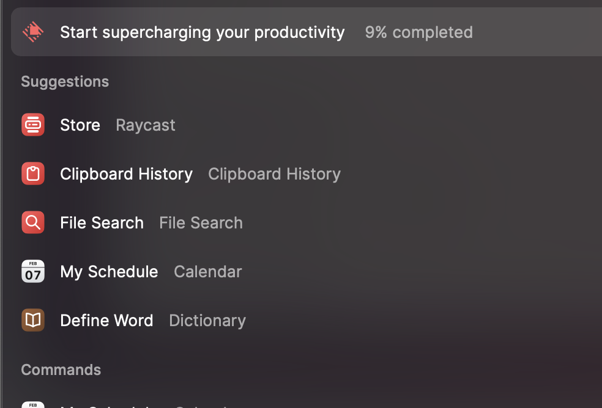

# Serving multiple applications from one Digital Ocean droplet

We are going to use Nginx as a reverse-proxy to serve multilple javascript applications from a single DO droplet.
We will use several different frameworks to show how the set up slightly differs for each of them. We will also use a couple of different servers as apis from which we will fetch data in our applications.

The basic directory structure will be something like this:


```
.
│-- .github
│   └── workflows
│		└── action.yml
├── Dockerfile
├── docker-compose.yml
├── conf.d
│   ├── cra.conf
│   ├── nxtjs.conf
│   └── veet.conf
├── frontend-applications
│   ├── cra
│   ├── nxtjs
│   └── veet
└── server-applications
    ├── api
    └── spring
```

The `Dockerfile` at the root of this directory is there to create the Nginx reverse proxy and configure the endpoints for our frontend applications using the nginx configuration files located in the `conf.d` folder.

*Dockerfile*

```yaml
FROM nginx
COPY ./conf.d /etc/nginx/conf.d
```

*docker-compose.yml*

```yaml
version: "3.9"
services:
  spring:
    image: andrewt51/spring
  api:
    depends_on:
      - mongodb
    image: andrewt51/api
  cra:
    depends_on:
      - reverse-proxy
    image: andrewt51/cra
  nxtjs:
    depends_on:
      - reverse-proxy
    image: andrewt51/nxtjs
  veet:
    depends_on:
      - reverse-proxy
    image: andrewt51/veet
  mongodb:
    image: mongo:latest
  reverse-proxy:
    restart: always
    build: .
    ports:
      - "80:80"
```

## Inside the conf.d folder
*cra.conf*

```nginx
upstream nxtjs {
    server nxtjs:3000;
}

upstream nxtjs-api {
    server spring:8080;
}

server {
    listen 80;
    server_name nextjs.triggatron.co.uk;  

    location ~ ^/api(.*) {
        proxy_pass $scheme://nxtjs-api$1;
        proxy_set_header Host $host;
        proxy_set_header X-Real-IP $remote_addr;
        proxy_set_header X-Forwarded-For $proxy_add_x_forwarded_for;
        proxy_set_header X-Forwarded-Proto $scheme;
    }

    location / {
        proxy_pass $scheme://nxtjs;
        proxy_set_header Host $host;
        proxy_set_header X-Real-IP $remote_addr;
        proxy_set_header X-Forwarded-For $proxy_add_x_forwarded_for;
        proxy_set_header X-Forwarded-Proto $scheme;
    } 
}

```


*veet.conf*

```nginx
upstream veet {
    server veet:80;
}

upstream veet-api {
    server api:3000;
}

server {
    listen 80;
    listen [::]:80;
    server_name veet.triggatron.co.uk triggatron.co.uk;  

    location ~ ^/api(.*) {
        proxy_pass $scheme://veet-api$1;
        proxy_set_header Host $host;
        proxy_set_header X-Real-IP $remote_addr;
        proxy_set_header X-Forwarded-For $proxy_add_x_forwarded_for;
        proxy_set_header X-Forwarded-Proto $scheme;
    }

    location / {
        proxy_pass $scheme://veet;
        proxy_set_header Host $host;
        proxy_set_header X-Real-IP $remote_addr;
        proxy_set_header X-Forwarded-For $proxy_add_x_forwarded_for;
        proxy_set_header X-Forwarded-Proto $scheme;
    }
    
}
```

*nxtjs.conf*

```nginx
upstream nxtjs {
    server nxtjs:3000;
}

upstream nxtjs-api {
    server spring:8080;
}

server {
    listen 80;
    server_name nextjs.triggatron.co.uk;  

    location ~ ^/api(.*) {
        proxy_pass $scheme://nxtjs-api$1;
        proxy_set_header Host $host;
        proxy_set_header X-Real-IP $remote_addr;
        proxy_set_header X-Forwarded-For $proxy_add_x_forwarded_for;
        proxy_set_header X-Forwarded-Proto $scheme;
    }

    location / {
        proxy_pass $scheme://nxtjs;
        proxy_set_header Host $host;
        proxy_set_header X-Real-IP $remote_addr;
        proxy_set_header X-Forwarded-For $proxy_add_x_forwarded_for;
        proxy_set_header X-Forwarded-Proto $scheme;
    }
    
}
```


## The frontend applications
Each of the following frameworks are set up as per their documentation, but also a Dockerfile is added in the root of each frontend framework folder

#### Vite
*./frontend-applications/vite/Dockerfile*

```yaml
FROM node:16-alpine as builder

WORKDIR /app

COPY ./package.json ./
RUN npm install

COPY . .
RUN npm run build

FROM nginx

EXPOSE 80

COPY --from=builder /app/build /usr/share/nginx/html
```

#### Create React app
*./frontend-applications/cra/Dockerfile*

```yaml
FROM node:16-alpine  AS builder
ENV NODE_ENV production

# Add a work directory
WORKDIR /app

# Cache and Install dependencies
COPY package.json .
COPY package-lock.json .
RUN npm install --production

# Copy app files
COPY . .

# Build the app
RUN npm run build

# Bundle static assets with nginx
FROM nginx as production
ENV NODE_ENV production

# Copy built assets from builder
COPY --from=builder /app/build /usr/share/nginx/html

# Start nginx
CMD ["nginx", "-g", "daemon off;"]
```
#### Nextjs
*./frontend-applications/nextjs/Dockerfile*

```yaml
# Install dependencies only when needed
FROM node:16-alpine AS deps
# Check https://github.com/nodejs/docker-node/tree/b4117f9333da4138b03a546ec926ef50a31506c3#nodealpine to understand why libc6-compat might be needed.
RUN apk add --no-cache libc6-compat
WORKDIR /app

# Install dependencies based on the preferred package manager
COPY package.json yarn.lock* package-lock.json* pnpm-lock.yaml* ./
RUN \
  if [ -f yarn.lock ]; then yarn --frozen-lockfile; \
  elif [ -f package-lock.json ]; then npm ci; \
  elif [ -f pnpm-lock.yaml ]; then yarn global add pnpm && pnpm i --frozen-lockfile; \
  else echo "Lockfile not found." && exit 1; \
  fi


# Rebuild the source code only when needed
FROM node:16-alpine AS builder
WORKDIR /app
COPY --from=deps /app/node_modules ./node_modules
COPY . .

# Next.js collects completely anonymous telemetry data about general usage.
# Learn more here: https://nextjs.org/telemetry
# Uncomment the following line in case you want to disable telemetry during the build.
# ENV NEXT_TELEMETRY_DISABLED 1

RUN yarn build

# If using npm comment out above and use below instead
# RUN npm run build

# Production image, copy all the files and run next
FROM node:16-alpine AS runner
WORKDIR /app

ENV NODE_ENV production
# Uncomment the following line in case you want to disable telemetry during runtime.
# ENV NEXT_TELEMETRY_DISABLED 1

RUN addgroup --system --gid 1001 nodejs
RUN adduser --system --uid 1001 nextjs

COPY --from=builder /app/public ./public

# Automatically leverage output traces to reduce image size
# https://nextjs.org/docs/advanced-features/output-file-tracing
COPY --from=builder --chown=nextjs:nodejs /app/.next/standalone ./
COPY --from=builder --chown=nextjs:nodejs /app/.next/static ./.next/static

USER nextjs

EXPOSE 3000

ENV PORT 3000

CMD ["node", "server.js"]

```

## The server side applications
### Node express
### Kotlin with Spring boot


